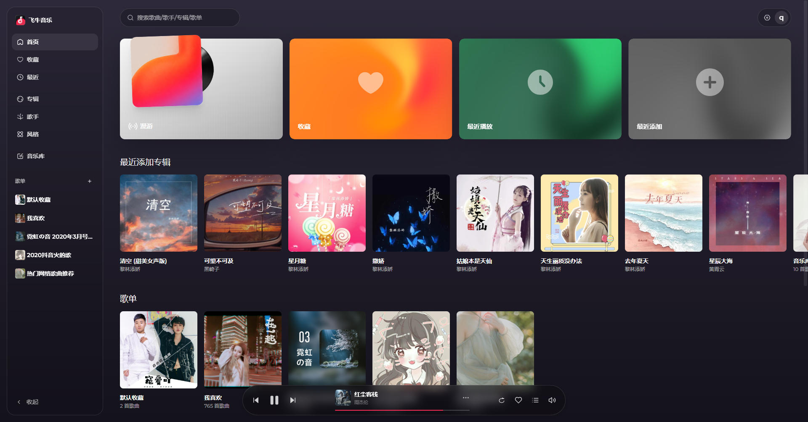

# 飞牛音乐酷狗扩展 FPK

为飞牛音乐（`trim_music`）接入自建 **KuGouMusicApi** 作为外部音源。

一键安装、图形化配置向导、零命令。酷狗是**唯一外部音源**——历史上的 musicdl / musicbox / 网易云接入已全部下线，仓库里不再有相关代码。

> ## ⚠️ 重要：KuGouMusicApi 需自行部署，本 FPK 不包含它
>
> **本扩展不含任何音源，自身不连接酷狗服务器。** 它是飞牛音乐与一个由**你自己部署**的 [KuGouMusicApi](https://github.com/MakcRe/KuGouMusicApi) 实例之间的**反向代理**。
>
> 若未先部署 KuGouMusicApi，本扩展**装上也无法工作**——搜索不到酷狗结果，`/_ext/healthz` 返回 `"kugou":"fail"`（HTTP 状态不符则为 `"http_<code>"`）。请先按 [安装 · 第 0 步](#安装-第-0-步先部署-kugoumusicapi必做) 完成部署。

## 灵感与来源

本项目参考并构建了以下项目：

- [javycoder/fnos_music_ext](https://github.com/javycoder/fnos_music_ext) —— 飞牛音乐扩展框架，本项目的起点
- [MakcRe/KuGouMusicApi](https://github.com/MakcRe/KuGouMusicApi) —— 酷狗音乐 API，提供搜索、直链、歌词与元数据能力

## 效果展示




## 架构

```
  飞牛音乐客户端
        │  HTTP
        ▼
 /var/run/trim_music.socket          ← 本扩展在此接管
        │  (FastAPI 代理 app.py)
        ├── 拦截：search / metadata / stream / lyrics / 封面
        │        → 拉酷狗源、合并官方结果、返回
        └── 透传：其余全部请求
                │  httpx UDS
                ▼
 /var/run/trim_music_upstream.socket ← 官方服务（只改名，未改动）
                │
                ▼
        KuGouMusicApi (kugou_url)
```

**零侵入**：不修改飞牛官方 nginx、二进制、数据库，只换 socket 文件名。卸载即还原。

## 功能

| 能力 | 说明 |
|---|---|
| 搜索合并 | track / artist / album / playlist / suggest 五类，官方结果在前、酷狗在后，**不去重** |
| 分页 | PC 端按 `page/size` 切合并全量；手机端不传分页时轮询酷狗全量（上限 480/500） |
| 在线播放 | `/track/stream` + HLS 兜底 + `preset.m3u8`，边播边存磁盘缓存回放 |
| 歌词 | 从 KuGouMusicApi 拉取，磁盘 sidecar 缓存 |
| 封面 | 代理主动上传换官方 `coverId` 并回写；统一 1600 尺寸；磁盘缓存 |
| 歌手/专辑/歌单 | `track/artist-detail`、`track/album-detail`、`playlist/detail`、`playlist/batch-detail` |
| 收藏 | 只读注入：GET `/favorite-track/list` 会从本地收藏文件读入并合并；**写入链路不可达**（见 FAQ） |
| 播放历史 | 透传上游，兜底补空 `coverId` |
| 登录 | 二维码登录 KuGouMusicApi（`/_ext/login/qr/*`） |
| 健康检查 | `/_ext/healthz` |

未拦截的路径全部原样转发。`/music/api/v1/` 下代理只接管 GET（`_is_get_request` 闸门），`/_ext/` 下另有本代理自己实现的 POST（settings / login logout）。详见 FAQ。

## 目录结构

```
fnmusic-ext-kugou-fpk/
├── LICENSE                          # GPL-2.0 协议（仓库根目录，不随 FPK 打包）
├── build-fpk.sh                     # 打包脚本（本地跑，含语法/JSON 校验）
├── images/                          # README 展示用截图
├── fnpack-1.2.3-linux-amd64         # 打包工具
├── dist/                            # 产物：fnmusic_ext_kugou-2.0.0.fpk
└── fnmusic-ext-kugou.fpk/           # FPK 源码目录
    ├── manifest                     # 应用元信息（appname / version / 作者地址）
    ├── ICON.png ICON192.png ICON256.png
    ├── app/                         # → 安装后落到 TRIM_APPDEST（app/ 前缀由 fnpack 剥离）
    │   ├── .env                     # 用户配置（安装时生成，chmod 600）
    │   ├── proxy/
    │   │   ├── app.py               # 主代理（FastAPI，约 6618 行）
    │   │   ├── kugou_source.py      # 酷狗源适配（搜索/直链/歌词/元数据）
    │   │   ├── app_socket_bridge.py # 网关桥接器：剥 /app/fnmusic_ext_kugou 前缀后转发
    │   │   ├── run_proxy.sh         # socket 探测 + 接管 + 启动 uvicorn
    │   │   └── requirements.txt     # fastapi / uvicorn / httpx / mutagen
    │   ├── ui/config                # 应用中心入口（iframe + 网关前缀）
    │   └── web/settings.html        # 设置页
    ├── cmd/                         # 生命周期钩子
    │   ├── install_init             # 前置检查（仅写日志）
    │   ├── install_callback         # 找 python3.12、建 venv、装依赖、语法检查、生成 .env
    │   ├── main                     # 进程管理：start / stop / status
    │   ├── start_init / start_callback / stop_callback
    │   ├── upgrade_init / upgrade_callback   # 升级后 py_compile（不阻断）
    │   └── uninstall_init / uninstall_callback # 卸载前还原 socket
    ├── config/
    │   ├── privilege                # run-as: root
    │   └── resource                 # 无额外共享
    └── wizard/
        ├── wizard.json              # 向导定义
        └── ui/index.html            # 配置页面
```

## 安装

### 安装第 0 步：先部署 KuGouMusicApi（必做）

**这一步由用户自行完成，本仓库与 FPK 均不包含 KuGouMusicApi，应用中心也不会替你安装它。**

[KuGouMusicApi](https://github.com/MakcRe/KuGouMusicApi) 是独立的上游项目，负责对接酷狗服务器、返回搜索/直链/歌词/元数据。本扩展只是「飞牛音乐 ←→ 你的 KuGouMusicApi」之间的桥，没有它就没有音源。

典型部署方式（以 Docker Compose 为例）：

```yaml
services:
  kugou-music-api:
    image: <上游项目提供的镜像>   # 以 https://github.com/MakcRe/KuGouMusicApi 仓库说明为准
    ports:
      - "8899:8899"
    restart: unless-stopped
    environment:
      - TZ=Asia/Shanghai
```

部署后**从飞牛 NAS 本机**验证可达：

```bash
curl -sS http://127.0.0.1:8899/health || curl -sS http://127.0.0.1:8899/
# 有 HTTP 响应即可；若返回 000 / 连接超时，说明地址或端口填错
```

> **地址填写规则**
> - KuGouMusicApi 跑在 **NAS 本机容器** → `http://127.0.0.1:8899`
> - 跑在 **另一台服务器** → `http://<对方IP>:<端口>`，并确认防火墙放行该端口
> - 本扩展从 **NAS 容器内部**发请求，所以填的是「NAS 访问它」的地址，**不是你浏览器的地址**

### 安装第 1~4 步

1. 飞牛应用中心 → 右上角「手动安装」→ 上传 `dist/fnmusic_ext_kugou-2.0.0.fpk`
2. 授权 root 权限
3. 配置向导：填 KuGouMusicApi 地址 → 选音质 → 保存
4. 打开飞牛音乐，搜索即可

**前置条件**

- **KuGouMusicApi 已自行部署并可访问**（本机 `http://127.0.0.1:8899`，远程填对应 IP:端口）—— 见「安装第 0 步」
- 飞牛官方音乐应用（`trim.music`）已安装并**处于运行中**
- Python 3.12（manifest 声明 `install_dep_apps="trim.music:python312"`，应用中心自动装）

## 运行时布局

`TRIM_APPDEST` 实际为 `/var/apps/fnmusic_ext_kugou/target`（`/vol1/@appcenter/fnmusic_ext_kugou` 是同一份应用目录的另一路径）。源码里的 `app/` 一层由 fnpack 剥离，**部署后是扁平结构**（下称 `$DEST`）：

| 路径 | 用途 |
|---|---|
| `$DEST/proxy/` | 代理代码（`app.py` / `kugou_source.py` / `app_socket_bridge.py`） |
| `$DEST/.env` | 用户配置（向导与设置页写入，chmod 600） |
| `$DEST/.venv-proxy/` | Python 虚拟环境（约 35M，升级保留） |
| `$DEST/cache/` | 音频与歌词缓存 |
| `$DEST/app/home/cache/` | 封面 ID 缓存 `cover_ids.json`（路径成因见 FAQ） |
| `$DEST/app/home/online_favorites/` | 收藏读取目录（写入分支不可达，见 FAQ） |
| `$DEST/log/proxy.log` | 代理运行日志（超 10MB 自动轮转为 `.1`） |
| `/tmp/fnmusic-ext-main.log` | `cmd/main` 进程管理日志 |
| `/tmp/fnmusic-ext-run.log` | 启动器日志 |
| `/tmp/fnmusic-ext.pid` | 代理 PID |
| `$DEST/fnmusic_ext_kugou.sock` | 网关桥接器监听 |
| `/var/run/trim_music.socket` | 代理占用（被接管） |
| `/var/run/trim_music_upstream.socket` | 官方服务（改名保留） |

运行进程：`uvicorn app:app --app-dir $DEST/proxy --uds /var/run/trim_music.socket`，外加一个桥接器进程。**不用 systemd** —— `cmd/main` 用 `nohup` 拉起两者，PID 记在 `/tmp/fnmusic-ext.pid`。

两个 socket 各服务一个客户端：

| socket | 监听方 | 服务对象 |
|---|---|---|
| `/var/run/trim_music.socket` | uvicorn 代理 | 飞牛音乐客户端 |
| `$DEST/fnmusic_ext_kugou.sock` | `app_socket_bridge.py` | 飞牛统一网关（`/app/fnmusic_ext_kugou` 前缀） |

## 配置

设置页与 `/wizard/ui/index.html` 可改三项：

| 字段 | 取值 | 默认 |
|---|---|---|
| `kugou_url` | KuGouMusicApi 地址 | `http://127.0.0.1:8899` |
| `kugou_quality` | `high` / `320` / `128` / `64` | `high` |
| `kugou_enabled` | `1` / `0` | `1` |

音质按 `high → 320 → 128 → 64` 逐级回退取直链，取不到直接降级不报错。320kbps 需 KuGou VIP 账号。

`.env` 其余键（登录态与调优）：

```
FNMUSIC_KUGOU_TOKEN / _USERID / _DFID / _T1 / _MID / _GUID / _DEV / _MAC   # 登录凭证
FNMUSIC_KUGOU_SEARCH_TIMEOUT=15   # 单请求超时（秒）
FNMUSIC_KUGOU_SEARCH_LIMIT=480    # 搜索全量上限（酷狗 track）
FNMUSIC_KUGOU_META_LIMIT=500      # 元数据全量上限（artist / album）
FNMUSIC_KUGOU_STEP=50             # 轮询步长
FNMUSIC_MERGE_SUGGEST=1           # suggest 是否合并酷狗
FNMUSIC_MERGE_SEARCH_META=1       # 元数据搜索是否合并酷狗
FNMUSIC_COVER_UPLOAD_ENABLED=1    # 封面回写开关
FNMUSIC_ONLINE_LIMIT=30           # 在线播放缓存条数
FNMUSIC_SEARCH_CACHE_TTL=300      # 搜索缓存秒数
```

改 `.env` 后需重启应用生效（`cmd/main stop && cmd/main start`）。

## 常用命令

```bash
# 健康检查
curl -s --unix-socket /var/run/trim_music.socket \
     http://localhost/_ext/healthz
# → {"ok":true,"upstream":"ok","kugou":"ok"}
# ok=false 时看 upstream / kugou 哪一侧是 fail

# 登录状态
curl -s --unix-socket /var/run/trim_music.socket \
     http://localhost/_ext/login/status

# 应用中心入口（浏览器）
# https://<nas>/app/fnmusic_ext_kugou

# 实时日志
tail -f /var/apps/fnmusic_ext_kugou/target/log/proxy.log
```

`kugou` 字段取值：`ok` / `fail` / `disabled` / `http_<status>`。

## 打包

```bash
./build-fpk.sh
```

脚本顺序：`py_compile` 三个 Python 文件 → `bash -n` 全部 shell → JSON 校验 → `fnpack build` → 产物拷到 `dist/`。

`fnpack` 可从 <https://www.fnnas.com/download/fnpack> 下载，放到本目录，或设 `FNPACK_BIN=/path/to/fnpack`。

## 卸载

应用中心 → 已安装 → 卸载。

`uninstall_init` 通过 healthz 判断 `trim_music.socket` 是否为代理占用：

- 是代理 → 删除，并把 `_upstream.socket` 还原回去
- 不是 → 不碰，避免误删官方服务

卸载后飞牛音乐自动切回官方模式。

彻底清理：

```bash
sudo rm -rf /var/apps/fnmusic_ext_kugou/target
sudo rm -rf /var/apps/fnmusic_ext_kugou/var
```

## 升级

覆盖安装即可。`upgrade_callback` 对新代码做 `py_compile`（失败仅告警不阻断），保留 `.venv-proxy` / `.env` / `cache/`，用户数据不丢。

## 常见问题

**Q: 这个 FPK 里已经自带 KuGouMusicApi 吗？**
没有。本扩展**不含任何音源**，装完也不会自动下载或部署 KuGouMusicApi，飞牛应用中心同样装不了它。请先自行部署 [MakcRe/KuGouMusicApi](https://github.com/MakcRe/KuGouMusicApi) 实例，再在本扩展里填它的地址（见 [安装第 0 步](#安装-第-0-步先部署-kugoumusicapi必做)）。本扩展只做反向代理与结果合并。

**Q: 安装后启动失败，日志说"未探测到存活的 trim-music socket"**
先在应用中心确认官方音乐应用处于「运行中」，再来装本扩展。代理必须接管一个真实存在的官方 socket。

**Q: `healthz` 显示 `kugou: fail`（或 `http_404` / `http_500`）**
说明 KuGouMusicApi 实例没起来、地址填错，或不是 KuGouMusicApi 那个服务。

`kugou` 字段完整取值：

| 值 | 含义 |
|---|---|
| `ok` | 连通正常，探测端点 `/login/qr/key` 返回 200 |
| `fail` | 连不上（地址错误、未启动、防火墙拦截、超时） |
| `http_<code>` | 连得上但返回非 200——通常地址指向了错误的服务 |
| `disabled` | `.env` 里 `FNMUSIC_KUGOU_ENABLED=0`，酷狗源被主动关闭 |

探测方式是 GET `{kugou_url}/login/qr/key`，超时 3 秒。该端点无需登录凭证，因此也能作为部署是否成功的判据。

**Q: 音质只有 64kbps**
账号无 VIP 权益。回退链会自动降级，不报错但拿不到 320。

**Q: 搜索没有酷狗结果**
先看 `.env` 里 `FNMUSIC_KUGOU_URL` 是否为空，再查 `log/proxy.log` 里 `[SEARCH_KUGOU_ALL]` 相关行。酷狗源返回 `data: null` 时会重试，仍空则该次无酷狗项（官方结果不受影响）。

**Q: 封面不显示**
封面回写失败不影响出图，代理会拉 `singerimg.kugou.com` 的占位图兜底。相关配置：`FNMUSIC_COVER_UPLOAD_ENABLED`、`FNMUSIC_COVER_UPLOAD_SIZE=1600`。

**Q: 在线收藏/封面 ID 缓存找不到文件**
注意 `_HOME` 读的是 `FNMUSIC_HOME_DIR`，而启动脚本导出的是 `FNMUSIC_HOME`（少一个 `_DIR`），两者不匹配。因此 `cache_dir` 走扁平的 `$DEST/cache/`，而 `cover_ids.json` 与收藏目录实际落在 `$DEST/app/home/` 下。这是当前代码的已知行为，非损坏。

**Q: 在线收藏为什么一直是空的**
`save_online_favorites` 只被 `POST /favorite-track/create` 与 `/delete` 调用，但这两个端点第一行就走 `_is_get_request` 闸门，POST 一律转发上游（实测返回上游 `INVALID TOKEN`），本地写入分支永远进不去。目前收藏实际处于「只读」状态：`GET /favorite-track/list` 会从本地文件读入并合并，但没有任何路径会写入。要恢复写入需把这两个端点移出 `_is_get_request` 闸门。

**Q: 非 GET 请求代理怎么处理**
`/music/api/v1/` 下所有路由都过 `_is_get_request` 闸门，非 GET 直接原样转发上游，不碰请求体与返回体。例外是 `/_ext/` 下的三个端点（`POST /_ext/settings`、`POST /_ext/login/logout`），它们是本代理自己实现的真 POST。另注：`/music/api/v1/event/report`、`/favorite-track/create`、`/favorite-track/delete` 虽声明为 POST 路由，因闸门实际是永转发的空壳。

**Q: 想回退到官方纯音乐模式**
把 `.env` 里 `FNMUSIC_KUGOU_ENABLED=0`，重启应用。代理仍在运行但酷狗源关闭，`healthz` 显示 `kugou: disabled`。

## License

GPL-2.0，见 [`LICENSE`](./LICENSE)。

上游项目 [fnos_music_ext](https://github.com/javycoder/fnos_music_ext) 原为 MIT 授权；本项目在其基础上改造，以 GPL-2.0 授权发布。

`requirements.txt` 依赖各自按其协议分发：fastapi (MIT)、uvicorn (BSD-3-Clause)、httpx (BSD-3-Clause)、mutagen (GPL-2.0)。
